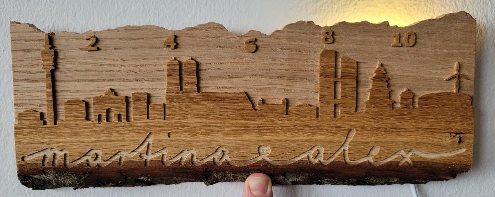
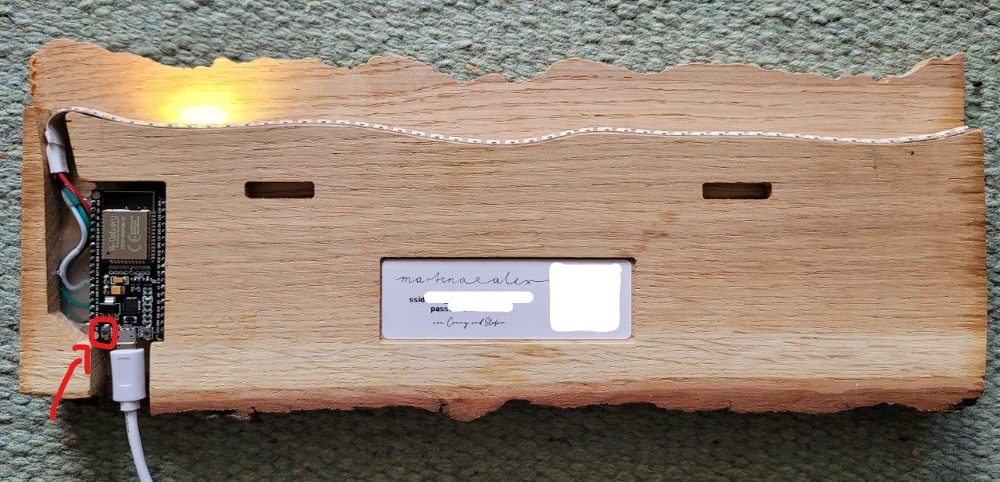
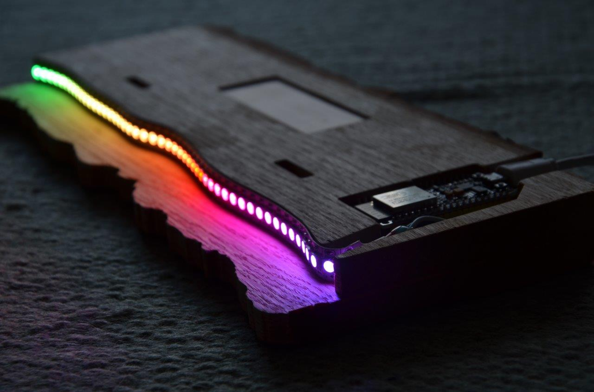

= Sunny City

The most beautiful way to show the time!

The yellow LED in the background indicates the current time on a beautiful oak wood with your city's skyline:

.SunnyCity for munich

Go to <<_startup_manual>> when this is your first time using the SunnyCity device.

[#backside]
.Back view of the SunnyCity, in red the RST/Reset button. The two openings can be used to hang it onto a wall.

.Detail view from top side

.Detail view from bottom side

== Time Display

The time is displayed according to the numbers on the top of the mountains. Starting point is on the left side with 12 AM/PM, and it ends on the right with 11:59 AM/PM.

Between sunrise and sunset, only a yellow sun is displayed. Between sunset and midnight, an orange moon with ambient background is shown. From midnight to sunrise a light blue moon shows up.

== Startup Manual

On first boot, the led lights up in rainbow colors and the device will try to connect to your Wi-Fi to get the current time and timezone to calculate the sunset and sunrise times.

If the device was never connected to your Wi-Fi network, our your credentials have changed, please follow the steps in <<_wifi_configuration>>.

=== WiFi Configuration

To set the device into configuration state, press the *RST* button on the backside, wait for *2-5 seconds* and press it again. The LEDs will light up blue-white. This will set the device in WiFi-Host mode.

Now search for the Wi-Fi network and connect to it with your smartphone or pc. The credentials can be found on the backside of the device.

After successful connection, your PC/Smartphone should automatically open the configuration page. If this does not work, go to link:http://192.168.4.1/[] with your favourite browser.

Press *CONFIGURATION*, select your Wi-Fi, enter the credentials for *YOUR*  Wi-Fi and press save. After that the device will reboot and after ~ 30 seconds the LEDs go to rainbow mode and then show the time.

If the LEDs stay in rainbow- or blue-white mode for longer than 1 minute, please try the steps from the beginning again. Watch for capital letters in your Wi-Fi-password.

== Examples

.One day starting from 12 AM.
video::img/daycycle.mp4[]

.Init sequence
video::img/initseq.mp4[]

== Questions, Bugs, Kudos

Please visit the link:https://github.com/5erv3/sunnyCity[github page] for code, details and questions.
